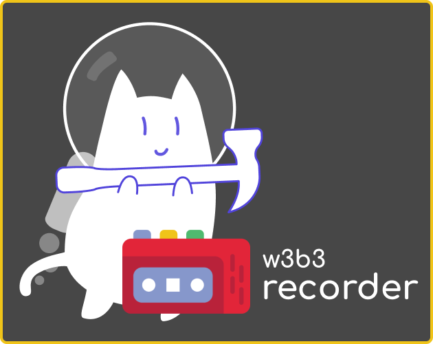

# W3B3 Recorder to ct.js - Catmods
> Record gameplays for reports and complaints about cheating users

## How to install - Todo

1. Download zip on [marcobrunodev.itch.io/w3b3cursor](https://marcobrunodev.itch.io/w3b3recorder)
2. Import zip on ct.js
   
## Get Started - Todo

1. Open ctjs in your PC

## Next features
[ ] documentation
[ ] mp4 recording

# License
[MPL-2.0](https://www.mozilla.org/en-US/MPL/2.0)